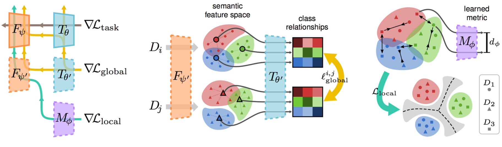

# MASF

<p align="left">
    
</p>

**_Domain Generalization via Model-Agnostic Learning of Semantic Features_**

> We study the challenging problem of domain generalization, i.e., training a model on multi-domain source data such that it can directly generalize to unseen target domains. We adopta model-agnostic learning paradigm with gradient-based meta-train and meta-testprocedures to expose the optimization to domain shift. Further, we introduce two complementary losses which explicitly regularize the semantic structure ofthe feature space. Globally, we align a derived soft confusion matrix to preservegeneral knowledge about inter-class relationships. Locally, we promote domain-independent class-specific cohesion and separation of sample features with ametric-learning component. 


This is the reference implementation of the domain generalization method described in our paper:
```
@inproceedings{dou2019domain,
    author = {Qi Dou and Daniel C. Castro and Konstantinos Kamnitsas and Ben Glocker},
    title = {Domain Generalization via Model-Agnostic Learning of Semantic Features},
    booktitle = {Advances in Neural Information Processing Systems (NeurIPS)},
    year = {2019},
}
```

If you make use of the code, please cite the paper in any resulting publications.

## Setup
Check dependencies in requirements.txt, and install necessarily run
```
pip install -r requirements.txt
```

## Running MASF
Download PACS dataset from [here](http://www.eecs.qmul.ac.uk/~dl307/project_iccv2017), and save it to dataroot as /path/to/PACS_dataset <br>
To run masf on with target domain as _art_painting_

```
python main.py --dataset pacs --target_domain art_painting --inner_lr 1e-5 --outer_lr 1e-5 --metric_lr 1e-5 --margin 10
```


